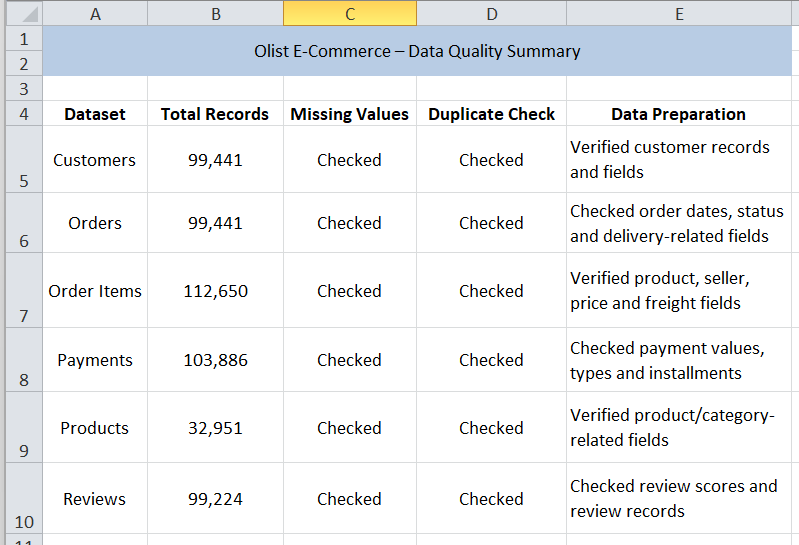
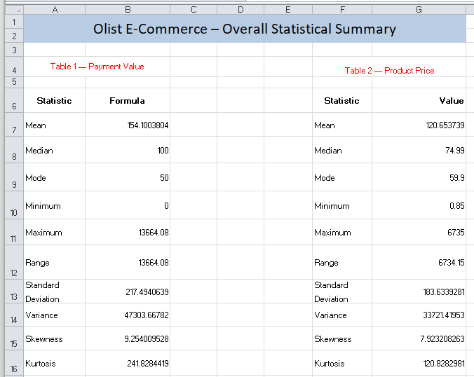
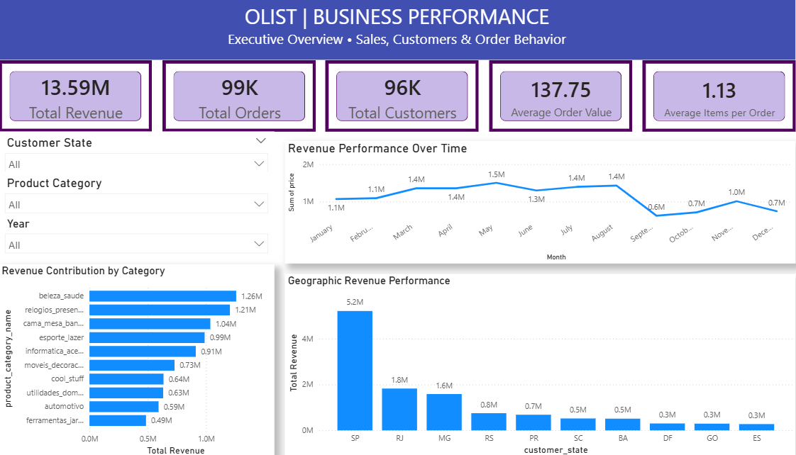
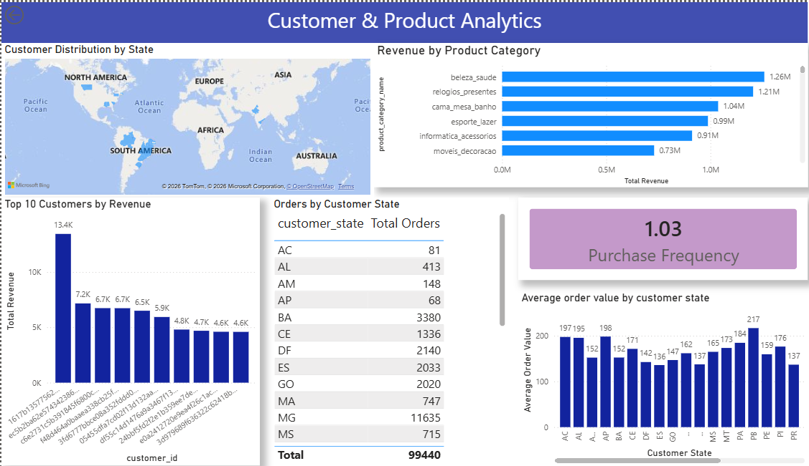
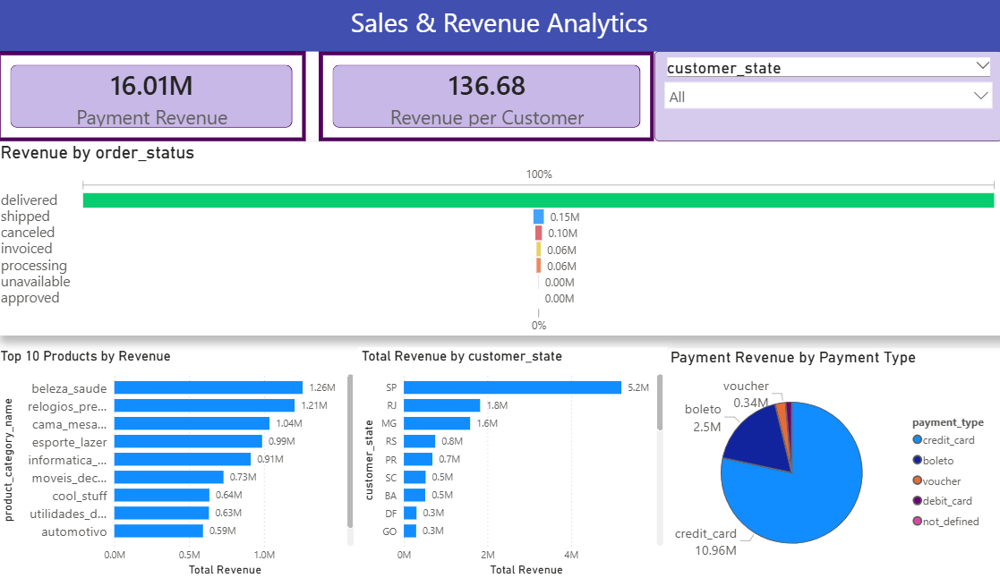

# Olist E-Commerce Analytics Project

## 📌 Project Overview

This project analyzes an e-commerce dataset to understand customer behavior, sales performance, product performance, payment patterns, delivery performance, and customer satisfaction.

The analysis was performed using three main tools:

- Excel – Data Exploration and Statistical Analysis
- MySQL – Business and Data Analysis using SQL
- Power BI – Interactive Dashboard and Data Visualization

---

## 🎯 Business Objectives

The main objectives of this project are to:

- Understand overall sales and revenue performance
- Identify important customer segments and high-value customers
- Analyze product and category performance
- Understand customer purchasing behavior
- Analyze payment methods and payment values
- Evaluate order and delivery performance
- Analyze customer reviews and satisfaction
- Present key findings through an interactive Power BI dashboard

---

# 🛠️ Tools & Technologies

| Tool | Purpose |
|---|---|
| Microsoft Excel | Data exploration, PivotTables, charts and statistical analysis |
| MySQL | SQL queries, joins, aggregations and business analysis |
| Power BI | Dashboard creation, DAX measures and interactive visualization |

---

# 📊 Project Workflow

The project followed this workflow:

Raw Data
↓
Excel EDA & Statistical Analysis
↓
SQL Business Analysis
↓
Power BI Dashboard
↓
Business Insights

---

# 📁 Dataset

The project uses the Olist Brazilian E-Commerce dataset.

The analysis uses the following datasets:

- Customers
- Orders
- Order Items
- Products
- Order Payments
- Order Reviews

---

# 📈 Excel Analysis & Data Quality

Excel was used for exploratory data analysis and statistical analysis.

### Analysis Performed

- Data quality checks
- PivotTables
- Charts
- Customer analysis
- Order analysis
- Payment analysis
- Product analysis
- Review analysis
- Price and payment statistics

Since the raw Excel file is too large to render directly on GitHub (>50MB), the data profiling tables, baseline statistical metrics, and validation workflows are fully documented below.

Before starting deep analytical transformations, a robust data profiling check was run across all Olist tables to ensure referential integrity.

| Dataset | Total Records | Missing Values | Duplicate Check | Data Preparation Details |
| :--- | :--- | :--- | :--- | :--- |
| **Customers** | 99,441 | Checked | Checked | Verified unique customer identifiers and localized geo-fields |
| **Orders** | 99,441 | Checked | Checked | Standardized purchase timestamps and handled delivery gaps |
| **Order Items** | 112,650 | Checked | Checked | Validated strict math constraints across seller pricing models |
| **Payments** | 103,886 | Checked | Checked | Cross-checked sequential voucher values and card transactions |
| **Products** | 32,951 | Checked | Checked | Structured category descriptions and translated product types |
| **Reviews** | 99,224 | Checked | Checked | Filtered missing text attributes while keeping active satisfaction ratings |



***

### Statistical Analysis

The following statistics were calculated for numerical variables:

- Mean
- Median
- Mode
- Minimum
- Maximum
- Range
- Standard Deviation
- Variance
- Skewness
- Kurtosis
  
Descriptive statistics were compiled to analyze distribution shapes, variances, and skewness for operational decision-making.

| Metric | Table 1 — Payment Value | Table 2 — Product Price |
| :--- | :--- | :--- |
| **Mean** | 154.10 | 120.65 |
| **Median** | 100.00 | 74.99 |
| **Mode** | 50.00 | 59.90 |
| **Minimum** | 0.00 | 0.85 |
| **Maximum** | 13,664.08 | 6,735.00 |
| **Range** | 13,664.08 | 6,734.15 |
| **Standard Deviation** | 217.49 | 183.63 |
| **Variance** | 47,303.67 | 33,721.42 |
| **Skewness** | 9.25 (Highly Right-Skewed) | 7.92 (Highly Right-Skewed) |
| **Kurtosis** | 241.83 (Heavy-Tailed) | 120.83 (Heavy-Tailed) |

#### 💡 Key Distribution Insights:
* **High Right-Skewness (9.25 & 7.92):** Both payment values and product prices are heavily skewed right, meaning the vast majority of e-commerce transactions are small-to-medium purchases, with a few massive outlier orders stretching the scale.
* **Extreme Kurtosis (241.83):** The massive payment kurtosis indicates a significant presence of heavy tails—outlier orders are frequent and substantial, requiring distinct segmenting strategies rather than looking only at baseline averages.



### Key Excel Findings

- São Paulo had the highest number of customers.
- Credit card was the most commonly used payment method.
- August recorded the highest number of orders.
- 5-star reviews were the most common review rating.
- Payment values showed strong positive skewness and high kurtosis.

---

# 🗄️ SQL Analysis

MySQL was used to answer business questions using SQL.

### Customer Analytics

- Customer distribution by state
- Most valuable customers
- Repeat customers
- Purchase frequency
- One-time vs repeat customers
- Customer retention rate
- Customer Lifetime Value

### Product Analytics

- Top products by sales
- Top products by revenue
- Product category revenue
- Average product price
- Highest and lowest product prices

### Sales & Revenue Analytics

- Monthly revenue
- Revenue by customer state
- Revenue by product category
- Top products by revenue
- Month-over-month revenue change

### Order & Delivery Analytics

- Orders by status
- Cancellation rate
- Average delivery time
- Late deliveries

### Customer Experience Analytics

- Average review score
- Review score distribution
- Customer satisfaction rate
- Monthly average review score

### Payment Analytics

- Total payment revenue
- Average payment value
- Most-used payment method
- Revenue by payment method
- Most preferred payment installments

### Seller Analytics

- Highest-revenue seller
- Average product price by seller
- Sellers with highest freight costs

---

# 📊 Power BI Dashboard

An interactive Power BI dashboard was created to present the main findings.

## Page 1 – Executive Overview

Provides a high-level overview of:

- Total Revenue
- Total Orders
- Total Customers
- Average Order Value
- Monthly Revenue Trend
- Overall business performance

## Page 2 – Customer & Product Analytics

Focuses on:

- Customer distribution by state
- Revenue by product category
- Top customers
- Orders by customer state
- Customer purchase frequency
- Customer-related KPIs

## Page 3 – Sales & Revenue Analytics

Focuses on:

- Revenue performance
- Revenue by state
- Revenue by product
- Order status
- Payment analysis
- Sales trends

---

# 💡 Key Business Insights

### Customer

São Paulo is an important customer and revenue market. The average purchase frequency is approximately 1.03 orders per customer, showing that most customers made around one purchase during the observed period.

### Products

The cama_mesa_banho category has the highest number of products, with 3,029 products, showing a large product variety in this category.

### Sales

São Paulo generated the highest revenue among customer states, making it an important market for the business.

### Payments

Credit card is the dominant payment method. Payment values are highly positively skewed, showing that a small number of high-value transactions have a strong effect on the average.

### Orders & Delivery

96,478 orders were delivered out of 99,441 total orders. 91,614 orders were delivered on time, while 7,827 were not delivered on time.

### Customer Reviews

5-star reviews were the most common, with 57,328 reviews, indicating generally positive customer satisfaction.

---

# 📷 Power BI Dashboard Preview

### Executive Overview



### Customer & Product Analytics



### Sales & Revenue Analytics



---

# 📂 Project Structure

```text
Olist-Ecommerce-Analytics
│
├──01_Screenshots
│   ├── Executive_Overview.png
│   ├── Customer_Product_Analytics.png
│   └── Sales_Revenue_Analytics.png 
│
├──02_PowerBI
│   └── Olist_Ecommerce_Dashboard.pbix 
│
├── 03_Excel
│   └── Olist_Ecommerce_Excel_EDA.xlsx
│
├──04_SQL
│   └── Olist_Ecommerce_SQL_Analysis.sql 
│
└── 05_README.md
